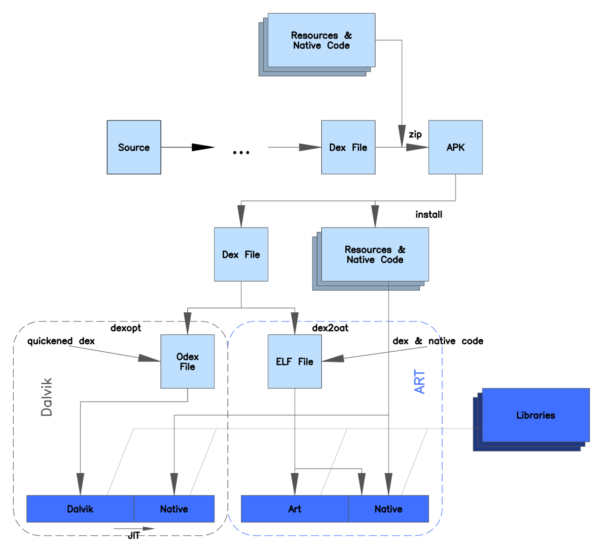
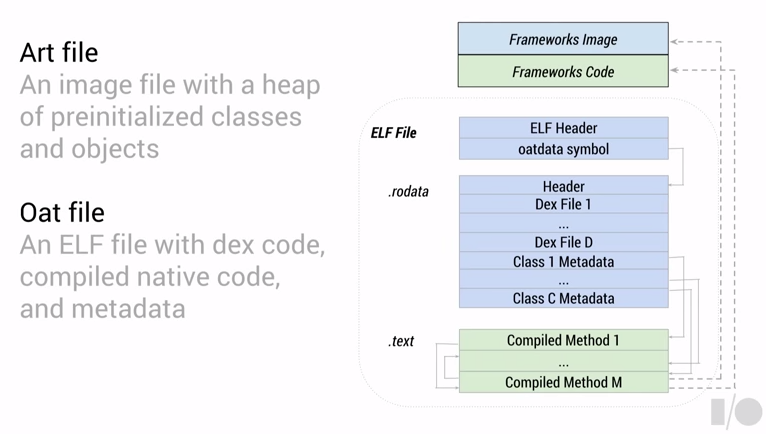
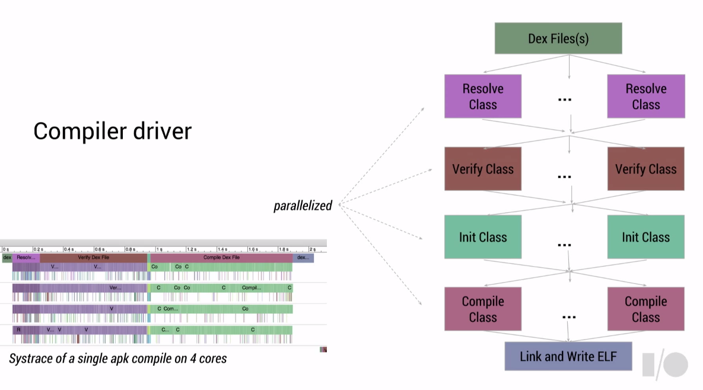
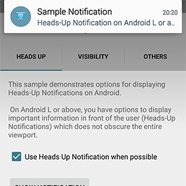

# Android 5 新特性尝鲜

-------

# Android Runtime

---

## Ahead-of-time(AOT) Compilation

ART模式中引入了能够改善性能的预编译方式。

> 在安装的过程中，ART使用dex2oat工具对应用进行预编译。这个工具会把dex文件转换成目标设备上的可执行程序。



	从上图可以看出Davik和ART的区别，Davik运行的过程中有JIT（对比AOT）的步骤，而ART是直接把dex通过工具转换成native的ELF可执行文件格式。
	再看下图，ART镜像文件的只读数据段包含了dex的数据和类的一些元数据，代码段是dex编译之后的方法
	（method，直接映射到框架的具体调用/native code）代码，这样就加快了运行速度。

> 编译出来的ART镜像文件格式：



	具体的编译过程如下图所示：



## ART编译器带来的好处

### 聚焦于面向对象程序的优化上

* 固化方法的调用
* 更快的接口调用
* 避免类初始化的检查
* 消除了异常的检测

### AOT同样利于

* 电池续航 － 编译一次，更快的运行
* 顺滑的内存曲线 － 更加的多任务执行


``` cpp
static jclass VMClassLoader_findLoadedClass(JNIEnv* env, jclass, jobject javaLoader, jstring javaName) {
  ScopedFastNativeObjectAccess soa(env);
  mirror::ClassLoader* loader = soa.Decode<mirror::ClassLoader*>(javaLoader);
  ScopedUtfChars name(env, javaName);
  if (name.c_str() == NULL) {
    return NULL;
  }
  ClassLinker* cl = Runtime::Current()->GetClassLinker();
  std::string descriptor(DotToDescriptor(name.c_str()));
  mirror::Class* c = cl->LookupClass(descriptor.c_str(), loader);
  if (c != NULL && c->IsResolved()) {
    return soa.AddLocalReference<jclass>(c);
  }
  if (loader != nullptr) {
    // Try the common case.
    StackHandleScope<1> hs(soa.Self());
    c = cl->FindClassInPathClassLoader(soa, soa.Self(), descriptor.c_str(), hs.NewHandle(loader));
    if (c != nullptr) {
      return soa.AddLocalReference<jclass>(c);
    }
  }
  // Class wasn't resolved so it may be erroneous or not yet ready, force the caller to go into
  // the regular loadClass code.
  return NULL;
}
```

## GC

# 通知和多任务

---

## Heads-Up Notification



**上图是Android 5新的通知方式。**

### 实现代码

---

``` java
	Notification createNotification(boolean makeHeadsUpNotification) {
        Notification.Builder notificationBuilder = new Notification.Builder(getActivity())
                .setSmallIcon(R.drawable.ic_launcher)
                .setPriority(Notification.PRIORITY_DEFAULT)
                .setCategory(Notification.CATEGORY_MESSAGE)
                .setContentTitle("Sample Notification")
                .setContentText("This is a normal notification.");
        if (makeHeadsUpNotification) {
            Intent push = new Intent();
            push.addFlags(Intent.FLAG_ACTIVITY_NEW_TASK);
            push.setClass(getActivity(), LNotificationActivity.class);

            PendingIntent fullScreenPendingIntent = PendingIntent.getActivity(getActivity(), 0,
                    push, PendingIntent.FLAG_CANCEL_CURRENT);
            notificationBuilder
                    .setContentText("Heads-Up Notification on Android L or above.")
                    .setFullScreenIntent(fullScreenPendingIntent, true); //FullScreen Heads－Up Notification
        }
        return notificationBuilder.build();
    }
```

**Heads-Up通知**是通过下面这个方法的调用实现的：

	public Notification.Builder setFullScreenIntent (PendingIntent intent, boolean highPriority)

> 如果用户正在使用这个设备时，调用这个方法后，系统UI可能会弹出Heads-Up通知，就像有电话打过来一样。


## 多任务视图
---

**Android 5.0 新增了Document-centric apps特性，它能够让同一个应用的多个Activity在最近使用的视图中看到，同时新增了AppTask类，用于辅助Activity的管理。**

### 在最近使用中（Recents）显示Activity
---

 

> Android 5.0还支持**`文档式的多任务`**视图，如果要使用该样式，可以在启动Activity的时候加入以下代码：


``` java
	Intent intent = ...
	intent.addFlags(Intent.FLAG_ACTIVITY_NEW_DOCUMENT);
	startActivity(intent);
```

> 这样就可以做到在同一个APP里进行多个Activity的切换。
 
 
### 新增的类（ActivityManager.AppTask）
---

> Android 5在ActivityManager增加了新的接口`getAppTasks()`，它可以获得当前的任务列表（List<AppTask>），开发者可以直接通过AppTask将任务转至前台、从Recents中挪开或者新启一个Activity。

| AppTask       | Public Methods | 
| ------------- |:-------------:|
| void		| finishAndRemoveTask() | 
| ActivityManager.RecentTaskInfo  | getTaskInfo() | 
| void 	| 		setExcludeFromRecents(boolean exclude) |
| void 	|		startActivity(Context context, Intent intent, Bundle options) |
| void 	|		moveToFront() |
 
 
# 高性能图形

---

Android 5.0的新特性包括了OpenGL ES 3.1和AEP扩展包。

## OpenGL ES 3.1 & AEP

* OpenGL ES 3.1相比3.0支持了`compute shader（通用计算着色器）`、`stencil texture（模板纹理）`等等。
* AEP提供桌面级GPU支持的特性（`曲面细分`和`几何着色器`、`ASTC纹理压缩`等等）。


## 支持ES 3.1的移动GPU系列

* 高通Adreno 420、430+
* ARM Mali T860+
* NVIDIA Tegra K1、X1


## 使用Compute Shader实现GPGPU应用


## OpenGL ES 3.1在3D图形后处理的应用


## 参考

* [Google I/O 2014 - The ART runtime][1]
* [ART Source Link][2]
* [Android 5.0 API changes][3]


[1]:https://www.youtube.com/watch?v=EBlTzQsUoOw
[2]:https://android.googlesource.com/platform/art/
[3]:http://developer.android.com/about/versions/android-5.0.html