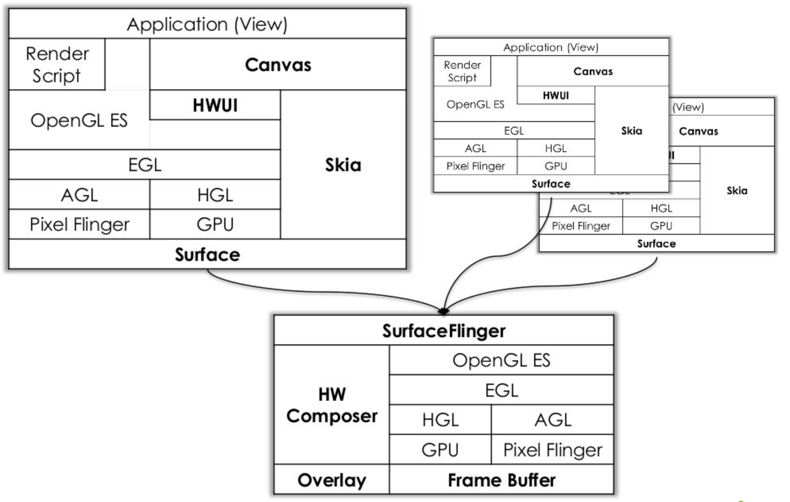
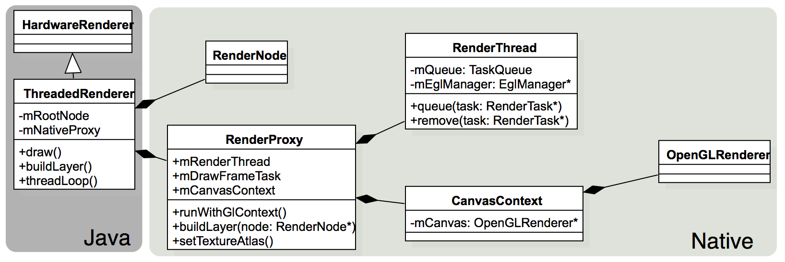
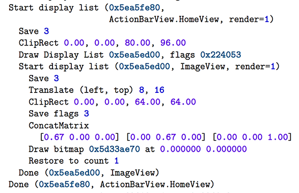
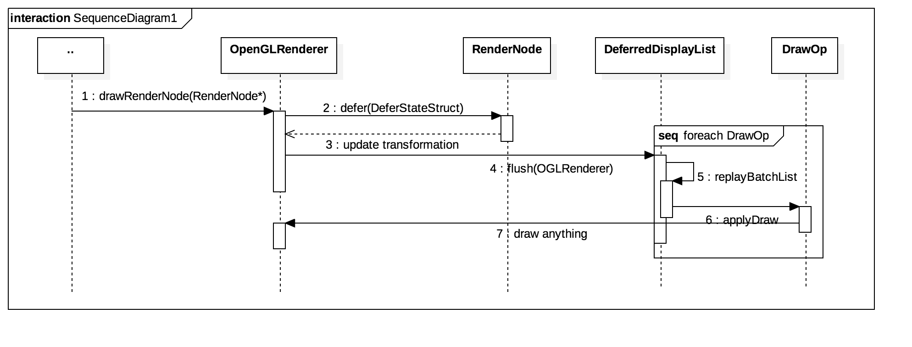
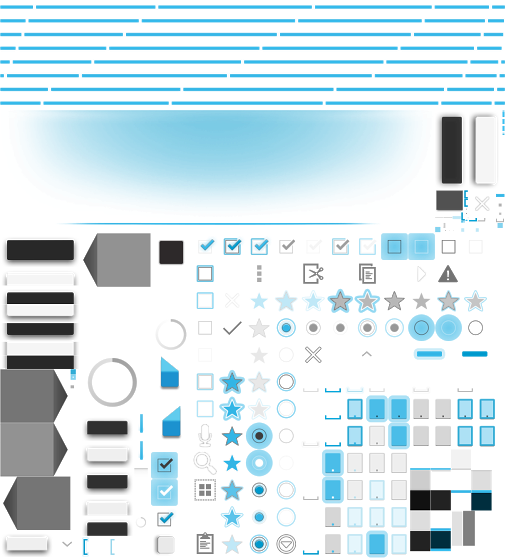
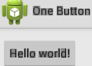
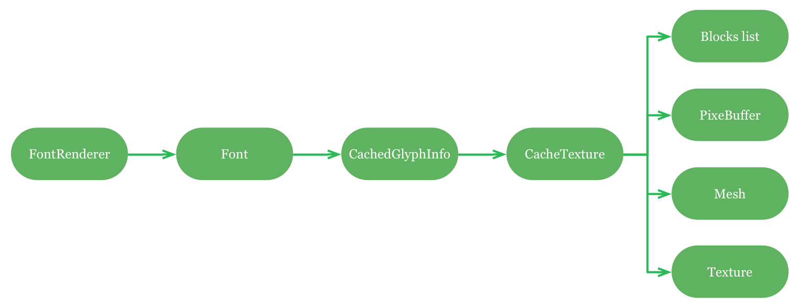

# Android HWUI硬件加速模块浅析

关键词：RenderNode，ThreadedRenderer，DisplayList，Atlas，FontRenderer

---

## 什么是硬件加速（What）

传统软件的UI绘制是依靠CPU来完成的，硬件加速就是将绘制任务交由GPU来执行。Android系统负责硬件加速的模块主要是**HWUI**，如下图所示：



---

## 为什么要硬件加速（Why）

Android HWUI硬件加速的底层实现是基于`OpenGL ES`接口向GPU提交指令来完成绘制的。硬件加速的优势在于：

* 在高屏幕分辨率环境下（尤其对于4K高清电视而言），GPU UI绘制的帧率要高于CPU，同时能减轻CPU的负担，如果只使用CPU进行软绘制的话，效费比太低。
* GPU相比CPU更加适合完成光栅化、动画变换等耗时任务，在移动设备上比起使用CPU来完成这些任务，GPU会更加省电，带来的用户体验也会更佳。
* 现代移动GPU支持可编程管线，可以高效地开发应用界面的一些特效（吸入、渐变、模糊、阴影）。

## 硬件加速的实现（How）

实现的源码位于目录[android/platform/framework/base/libs/hwui][3]

---

### 独立的渲染线程




在Android 5上，[ThreadedRenderer](https://android.googlesource.com/platform/frameworks/base/+/android-5.1.1_r2/core/java/android/view/ThreadedRenderer.java)的出现减轻了主线程的负担，可以更快的响应用户的操作。

> 下面是一段Android5硬件加速的一个crash堆栈，从这个调用关系中，我们可以大致知道从View到RenderNode的调用流程。

```
android.view.GLES20Canvas.nDrawRenderNode(Native Method)
android.view.GLES20Canvas.drawRenderNode(GLES20Canvas.java:233)
android.view.View.draw(View.java:15041)
android.view.ViewGroup.drawChild(ViewGroup.java:3405)
android.view.ViewGroup.dispatchDraw(ViewGroup.java:3199)
android.view.View.updateDisplayListIfDirty(View.java:14057)
android.view.View.getDisplayList(View.java:14085)
android.view.View.draw(View.java:14852)
android.view.ViewGroup.drawChild(ViewGroup.java:3405)
android.view.ViewGroup.dispatchDraw(ViewGroup.java:3199)
android.view.View.updateDisplayListIfDirty(View.java:14057)
android.view.View.getDisplayList(View.java:14085)
android.view.View.draw(View.java:14852)
android.view.ViewGroup.drawChild(ViewGroup.java:3405)
```

> 再看下nDrawRenderNode函数，在DisplayListRenderer的drawRenderNode方法里把RendeNode的DrawOp记录在了DisplayListData里。

```cpp
static jint android_view_GLES20Canvas_drawRenderNode(JNIEnv* env,
        jobject clazz, jlong rendererPtr, jlong renderNodePtr,
        jobject dirty, jint flags) {
    DisplayListRenderer* renderer = reinterpret_cast<DisplayListRenderer*>(rendererPtr);
    RenderNode* renderNode = reinterpret_cast<RenderNode*>(renderNodePtr);
	...
    status_t status = renderer->drawRenderNode(renderNode, bounds, flags);
    ...
    return status;
}
```

> 下图是DisplayList里记录的DrawOp:



---

### 显示列表和批次渲染(Display List & Batch Rendering)

> 下图是Android 5.1的OpenGL Renderer执行显示列表的流程：



> OpenGLRenderer类主要负责GL API的执行以及渲染状态的设置更新。


``` cpp
enum OpBatchId {
        kOpBatch_None = 0, // Don't batch
        kOpBatch_Bitmap,
        kOpBatch_Patch,
        kOpBatch_AlphaVertices,
        kOpBatch_Vertices,
        kOpBatch_AlphaMaskTexture,
        kOpBatch_Text,
        kOpBatch_ColorText,
        kOpBatch_Count, // Add other batch ids before this
    };
```

> 如上面代码所示，绘制的批次按**文本、图片资源、几何图形**等进行分类，分批绘制的效果如下图所示。


**那么HWUI又是如何对各个DrawOp进行合并的呢？**


> Android 4.4之后，HWUI模块通过Deferred Display List剔除过绘制的区域，完成DrawOp的分批和合并。

我们来看下***位于DeferredDisplayList.cpp中MergingDrawBatch类的canMergeWith方法***：

``` cpp
bool canMergeWith(const DrawOp* op, const DeferredDisplayState* state) {
        bool isTextBatch = getBatchId() == DeferredDisplayList::kOpBatch_Text ||
                getBatchId() == DeferredDisplayList::kOpBatch_ColorText;
        if (!isTextBatch || op->hasTextShadow()) {
            //如果不是文本或者操作包含阴影，并且和当前的渲染状态的包围盒相交，则不能合并
            if (intersects(state->mBounds)) return false;
        }
        const DeferredDisplayState* lhs = state;
        const DeferredDisplayState* rhs = mOps[0].state;
        /／Alpha值（透明度）不相等，同样不能合并
        if (!MathUtils::areEqual(lhs->mAlpha, rhs->mAlpha)) return false;
        ...
        // 操作绑定的着色器不一样，也不能合并
        if (op->mPaint && mOps[0].op->mPaint &&
            op->mPaint->getShader() != mOps[0].op->mPaint->getShader()) {
            return false;
        }
        ...
        return true;
    }
```

DrawOp合并与否取决于DrawOp对应渲染管线的状态是否一致，一般是把相同状态的DrawOp进行合并，达到减少渲染状态切换的效果。

HWUI模块中，DrawOp批次合并的实现主要在**DeferredDisplayList::addDrawOp方法**，如下面片段所示：

``` cpp
void DeferredDisplayList::addDrawOp(OpenGLRenderer& renderer, DrawOp* op) {
    ...
    // 获取渲染状态
    DeferInfo deferInfo;
    op->onDefer(renderer, deferInfo, *state);
    ...
    // 剔除过绘制批次
    if (CC_LIKELY(mAvoidOverdraw) && mBatches.size() &&
            state->mClipSideFlags != kClipSide_ConservativeFull &&
            deferInfo.opaqueOverBounds && state->mBounds.contains(mBounds)) {
        // avoid overdraw by resetting drawing state + discarding drawing ops
        discardDrawingBatches(mBatches.size() - 1);
        resetBatchingState();
    }
    ...
    // 将新的DrawOp合并至现有批次中
    // 首先，先找到现有批次中可以合并的Batch，我们希望这个批次是最新的
    DrawBatch* targetBatch = NULL;
    // insertion point of a new batch, will hopefully be immediately after similar batch
    // (eventually, should be similar shader)
    int insertBatchIndex = mBatches.size();
    if (!mBatches.isEmpty()) {
        if (state->mBounds.isEmpty()) {
            // don't know the bounds for op, so add to last batch and start from scratch on next op
            DrawBatch* b = new DrawBatch(deferInfo);
            b->add(op, state, deferInfo.opaqueOverBounds);
            mBatches.add(b);
            resetBatchingState();
            return;
        }
        if (deferInfo.mergeable) {
            // Try to merge with any existing batch with same mergeId.
            if (mMergingBatches[deferInfo.batchId].get(deferInfo.mergeId, targetBatch)) {
                if (!((MergingDrawBatch*) targetBatch)->canMergeWith(op, state)) {
                    targetBatch = NULL;
                }
            }
        } else {
            // join with similar, non-merging batch
            targetBatch = (DrawBatch*)mBatchLookup[deferInfo.batchId];
        }
        if (targetBatch || deferInfo.mergeable) {
            // iterate back toward target to see if anything drawn since should overlap the new op
            // if no target, merging ops still interate to find similar batch to insert after
            for (int i = mBatches.size() - 1; i >= mEarliestBatchIndex; i--) {
                DrawBatch* overBatch = (DrawBatch*)mBatches[i];
                if (overBatch == targetBatch) break;
                // TODO: also consider shader shared between batch types
                if (deferInfo.batchId == overBatch->getBatchId()) {
                    insertBatchIndex = i + 1;
                    if (!targetBatch) break; // found insert position, quit
                }
                if (overBatch->intersects(state->mBounds)) {
                    // NOTE: it may be possible to optimize for special cases where two operations
                    // of the same batch/paint could swap order, such as with a non-mergeable
                    // (clipped) and a mergeable text operation
                    targetBatch = NULL;
                    break;
                }
            }
        }
    }
    // 现有Batch中没有找到合适的Batch，我们只能创建新的批次并插入批次列表中
    if (!targetBatch) {
        if (deferInfo.mergeable) {
            targetBatch = new MergingDrawBatch(deferInfo,
                    renderer.getViewportWidth(), renderer.getViewportHeight());
            mMergingBatches[deferInfo.batchId].put(deferInfo.mergeId, targetBatch);
        } else {
            targetBatch = new DrawBatch(deferInfo);
            mBatchLookup[deferInfo.batchId] = targetBatch;
        }
        DEFER_LOGD("creating %singBatch %p, bid %x, at %d",
                deferInfo.mergeable ? "Merg" : "Draw",
                targetBatch, deferInfo.batchId, insertBatchIndex);
        mBatches.insertAt(targetBatch, insertBatchIndex);
    }
    targetBatch->add(op, state, deferInfo.opaqueOverBounds);
}
```

> DisplayList记录了绘制操作和状态，主线程将它们提交至OpenGL渲染器，由渲染器执行最终的DrawCall。


分批次渲染以及合并DrawOp带来的好处是显而易见的，**它大幅度的减少了OpenGL渲染状态的切换的开销（由于OpenGL ES的驱动实现的复杂性，每个GL的绑定调用以及GL状态的切换都会引起GL状态的检查以及同步操作）**。

---

### 创建纹理集



> AssetAtlasService对资源的加载在做了专门的管理，它为了减少图片资源上传至GPU的操作，对对各资源进行合并，打包（Atlas算法实现在[graphics/java/android/graphics/Atlas.java](https://android.googlesource.com/platform/frameworks/base/+/android-5.1.1_r2/graphics/java/android/graphics/Atlas.java)类里）成单张纹理进行上传，通过**UvMapper重新映射纹理坐标至[0，1]区间**，使UI依然能够正确绘制。


由于App的进程是从Zygonte进程fork出来的，所以AssetAtlasService加载的纹理资源可以共享给App。

ATLAS的使用减少了GPU显存的消耗，以及纹理单元（Texture Unit）绑定调用（Resource Binding）的开销。

---

### 字体绘制



文字的渲染也是一个令人头疼的问题，APP的文字渲染不像游戏中那样的简单，通常游戏发布的时候可以预先将固定的文字转换成单张的纹理，渲染文字时直接映射纹理坐标即可。Android底层对文字字形纹理数据进行了Cache。Android使用了Skia和第三方开源字体库（FreeType）对字体进行栅格化。



如果设备支持OpenGL ES 3.0，Android会使用**PixelBufferObject绑定**完成字体纹理的异步上传，这样做的好处在于通过映射方式（glMapBuffer）更加高效的上传纹理数据至GPU，具体实现在[libs/hwui/PixelBuffer.cpp](https://android.googlesource.com/platform/frameworks/base/+/android-5.1.1_r2/libs/hwui/PixelBuffer.cpp):

```c
GpuPixelBuffer::GpuPixelBuffer(GLenum format, uint32_t width, uint32_t height):
        PixelBuffer(format, width, height), mMappedPointer(0), mCaches(Caches::getInstance()) {
    glGenBuffers(1, &mBuffer);
    mCaches.bindPixelBuffer(mBuffer);
    glBufferData(GL_PIXEL_UNPACK_BUFFER, getSize(), NULL, GL_DYNAMIC_DRAW);
    mCaches.unbindPixelBuffer();
}

void GpuPixelBuffer::upload(uint32_t x, uint32_t y, uint32_t width, uint32_t height, int offset) {
    // If the buffer is not mapped, unmap() will not bind it
    mCaches.bindPixelBuffer(mBuffer);
    unmap();
    glTexSubImage2D(GL_TEXTURE_2D, 0, x, y, width, height, mFormat,
            GL_UNSIGNED_BYTE, reinterpret_cast<void*>(offset));
}

```
通过PBO减少字体纹理资源上传的等待时间，提高了界面流畅度。


---

### 应用场景

> 在我们平常的需求开发中会遇到一些场景可以通过使用硬件加速来完成，比如对复杂的布局执行Alpha渐变的动画时，我们可以直接设置父布局LayerType为`LAYER_TYPE_HARDWARE`。

```java
public class View implements Drawable.Callback, KeyEvent.Callback, AccessibilityEventSource {
    ......
    public void buildLayer() {
        ......
        final AttachInfo attachInfo = mAttachInfo;
        ......
        switch (mLayerType) {
            case LAYER_TYPE_HARDWARE:
                updateDisplayListIfDirty();
                if (attachInfo.mHardwareRenderer != null && mRenderNode.isValid()) {
                    attachInfo.mHardwareRenderer.buildLayer(mRenderNode);
                }
                break;
            case LAYER_TYPE_SOFTWARE:
                buildDrawingCache(true);
                break;
        }
    }
    ......
}
```

当View的LayerType设置为HARDWARE时，View就会绑定到一个OpenGL ES的FrameBufferObject上去，如果要对这个View进行Animation（Alpha，Rotation，etc.）,会将这个FrameBufferObject渲染至Texture（RTT，Render To Texture），然后再进行动画的渲染，但是这里要注意到内存的占用会增加。


## 硬件加速的改进

优化的点可以从API角度和GPU硬件特性展开：

* 参考iOS 8之后引入了Metal，原生支持多线程GPU渲染，Android由于GL驱动以及GPU厂商实现的差异无法很好地榨干GPU的机能，但是在下一代的图形API（[Vulkan][7]）普及之后，仍然有较大的优化空间，UI流畅性可以进一步提升。
* 大部分移动设备的GPU是基于分块渲染（Tile-based Rendering）的，批绘制的算法可以考虑依据Tile进行分批。

> 在今年的SIGGRAPH上，[Google已经公开支持Vulkan][8]，它将成为下一代Android设备上的主要图形接口

---

## 参考

1. [Efficient text rendering with OpenGL ES][1]
2. [Rendering Text in Metal with Signed-Distance Fields][2]
3. [老罗的Android之旅][4]
4. [How about some Android graphics true facts?][5]
5. [Introduction to the Android Graphics Pipeline][6]
6. [Gnomes per second in Vulkan and OpenGL ES][9]

---
[1]:https://medium.com/@romainguy/androids-font-renderer-c368bbde87d9
[2]:http://metalbyexample.com/rendering-text-in-metal-with-signed-distance-fields/
[3]:https://android.googlesource.com/platform/frameworks/base/+/android-5.1.1_r2/libs/hwui/
[4]:http://blog.csdn.net/Luoshengyang/
[5]:https://plus.google.com/105051985738280261832/posts/2FXDCz8x93s
[6]:http://mathias-garbe.de/files/introduction-android-graphics.pdf
[7]:https://www.khronos.org/vulkan
[8]:http://android-developers.blogspot.com/2015/08/low-overhead-rendering-with-vulkan.html
[9]:http://blog.imgtec.com/powervr/gnomes-per-second-in-vulkan-and-opengl-es