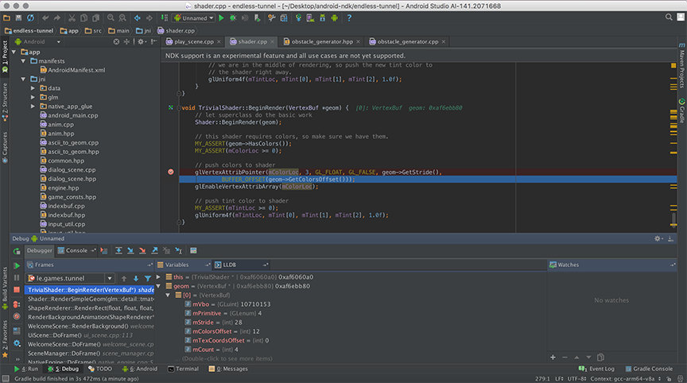
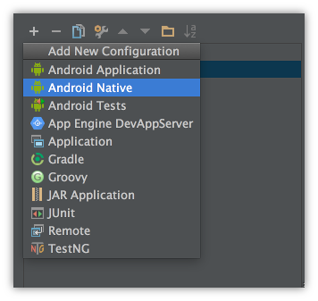
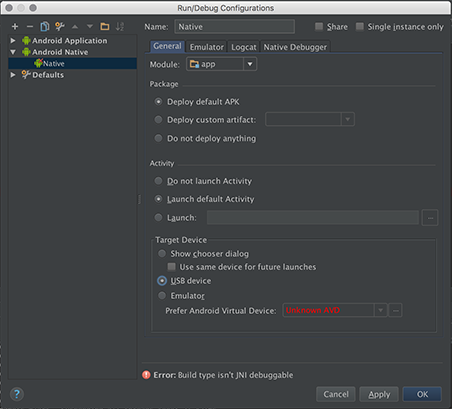
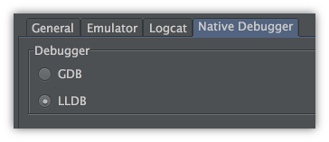
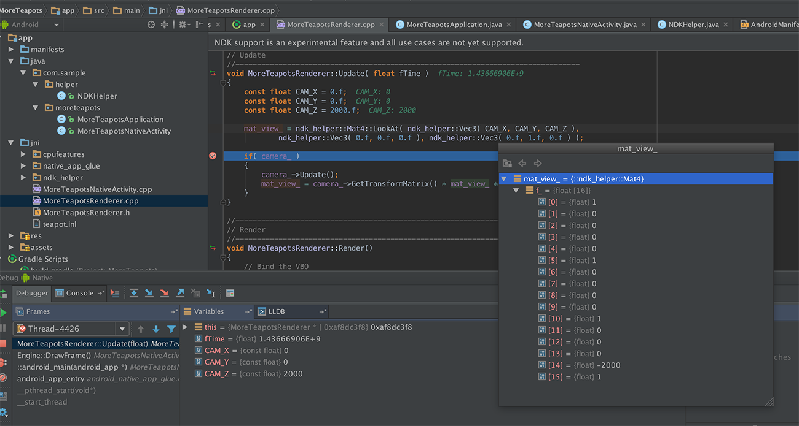
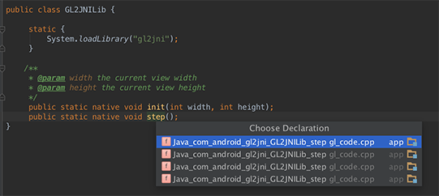

# Android NDK C++ 开发利器：Android Studio

----

在今年的Google IO大会上，Google宣布Android Studio开始支持NDK开发。通过和JetBrains的合作，将CLion整合进了[Android Studio 1.3][1]，并免费支持NDK C++开发。





## 使用Gradle编写C++项目脚本

下面这段工程脚本来自Google提供的[Sample][2]。

``` gradle

apply plugin: 'com.android.model.application'

model {
    android {
        compileSdkVersion = 22
        buildToolsVersion = "22.0.1"

        defaultConfig.with {
            minSdkVersion.apiLevel    = 9
            targetSdkVersion.apiLevel = 22
            versionCode     =  1
            versionName     = "1.0"
       }
    }
    android.ndk {
            moduleName = "game"
            cppFlags  += "-I${file("src/main/jni/native_app_glue")}".toString()
            cppFlags  += "-I${file("src/main/jni")}".toString()
            cppFlags  += "-I${file("src/main/jni/data")}".toString()
            ldLibs    += ["android", "EGL", "GLESv2", "OpenSLES", "log"]
            stl        = "stlport_static"
    }
    android.lintOptions {
        abortOnError  = false
    }

    android.buildTypes {
        release {
            isMinifyEnabled = true
        }
    }

    android.productFlavors {
        create ("arm7") {
            ndk.abiFilters += "armeabi-v7a"
        }
        create ("arm8") {
            ndk.abiFilters += "arm64-v8a"
        }
        create ("x86-32") {
            ndk.abiFilters += "x86"
        }
        // for detailed abiFilter descriptions, refer to "Supported ABIs" @
        // https://developer.android.com/ndk/guides/abis.html#sa

        // build one including all cpu architectures
        create("all")
    }
}

dependencies {
    compile fileTree(dir: 'libs', include: ['*.jar'])
    compile 'com.android.support:appcompat-v7:22.1.1'
}
```

NDK工程的编译配置脚本主要是下面几行：
>
    android.ndk {
            moduleName = `"game"`
            cppFlags  += "-I${file("src/main/jni/native_app_glue")}".toString()
            cppFlags  += "-I${file("src/main/jni")}".toString()
            cppFlags  += "-I${file("src/main/jni/data")}".toString()
            ldLibs    += ["android", "EGL", "GLESv2", "OpenSLES", "log"]
            stl        = "stlport_static"
    }


----

## 调试C++项目

调试项目之前，需要创建Native的调试配置。打开菜单Run－>Edit Configurations..，然后选择Native配置类型，如下图所示：




配置好后，选择运行的模块就行了。如果LLDB调试器挂了，可以换用GDB进行调试工作。



调试的体验和Visual Studio差不多，基本的功能都有，比Eclipse调试Native层可能要方便些。



----

## 代码编辑器支持的特性

* 支持Native函数和Java native方法的跳转和方法查找
* 支持C++代码高亮和代码补全




----
[1]:http://tools.android.com/download/studio/canary/latest
[2]:https://github.com/googlesamples/android-ndk