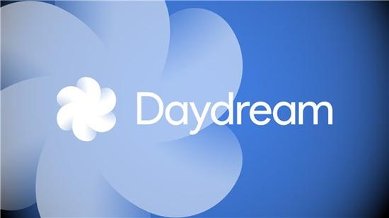
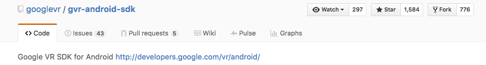
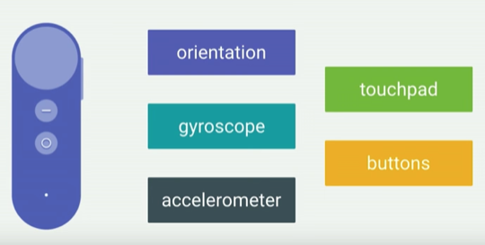

# Android 7 Nougat ：DayDream VR



> DayDreamVR 是Android 7引进来的新特性，这个版本提供了App的VR模式，同时定义了**VR头盔以及控制器**的一些接口标准，可以让手机制造商提供兼容该平台的VR设备。

---

## DayDream VR开发设置

当前Android VR的开发目前需要**Nexus 6P**来支持，目前市面上暂时没有手机能满足`DayDreamVR`的要求。


不过我们可以使用**另外一台手机**作为**DayDreamVR的手柄**，在Nexus 6P需要打开DayDreamVR的**开发者选项**通过蓝牙和手柄配对即可使用。


**下面就是Google提供的VR Sample：ControllerPaint运行截图：**


> 我们可以使用手柄在场景中拖动绘画，或者点击触控板点缀场景。


---

## DayDream Controller支持的能力

* 提供手柄朝向的数据
	* 用于基于Raycast算法实现射线与平面相交检测
* 支持连续的操作（拖动）
	* 更多地依赖陀螺仪提供的数据，可以支持**倾斜**、**转动**等连续性的操作
* 同样支持离散的操作
	* 依靠加速度计提供的数据，使得冲击性的动作易于侦测，比如**投掷**、**敲击** 
* 支持双手操作
* 触控板操作（TouchPad）
	* 这个触控板类似笔记本上的触摸板，可以控制2D平面上的方向，以及触摸点击操作
* 视角回正（Recenter）
	* 依赖手柄上的按钮

---

## DayDream Controller开发入手



目前，我们可以使用**Google VR SDK**来进行Android上的VR APP开发。



控制器的数据全部由`gvr::ControllerApi`提供，它可以提供**角速度，加速度，朝向，触控板触摸位置，手势**等信息。

```c
typedef struct gvr_controller_state {
  gvr_controller_api_status api_status;
  gvr_controller_connection_state connection_state;

  gvr_quatf orientation; //四元数表示手柄的朝向
  gvr_vec3f gyro; //陀螺仪角速度数据
  gvr_vec3f accel; //加速度读取 
  bool is_touching; //是否触摸了触控板
  gvr_vec2f touch_pos; // 触摸点

  bool touch_down;
  bool touch_up;
  ...
} gvr_controller_state;
```

GvrController的状态全部封装在结构体`gvr_controller_state`里，读取的时候调`ControllerApi::ReadState(&controller_state_)`方法即可;

头盔的信息则由`gvr::GvrApi`提供，我们可以通过它获取**头盔的姿态**，以及**左右眼的观察矩阵**。

```cpp
//获取头盔姿态和左右眼ViewMatrix
const gvr::HeadPose head_pose = gvr_api_->GetHeadPoseInStartSpace(pred_time);
const gvr::Mat4f left_eye_view_matrix =
      Utils::MatrixMul(gvr_api_->GetEyeFromHeadMatrix(GVR_LEFT_EYE),
                       head_pose.object_from_reference_matrix);
```

---

## 渲染

> 目前Google VR SDK的渲染是通过分别在左右眼的Viewport进行重复的绘制和畸变处理来完成渲染的。

**Google SDK VR的渲染流程大致如下：**

* 新建用于场景渲染的离屏FrameBufferObject（FBO）
* 绑定离屏FBO，将左右眼的场景渲染到这份FBO上
* 将上面的FBO作为纹理传输至下一个Pass做畸变矫正，输出至屏幕显示

---

## 参考

1. [Designing & Developing for the Daydream Controller - Google I/O 2016][1]
2. [Set up a Daydream Development Kit][2]
3. [Sample: ControllerPaint][3]

[1]:https://www.youtube.com/watch?v=l9OfmWnqR0M
[2]:https://developers.google.com/vr/concepts/dev-kit-setup
[3]:https://github.com/googlevr/gvr-android-sdk/tree/master/ndk-beta/demos/controllerpaint