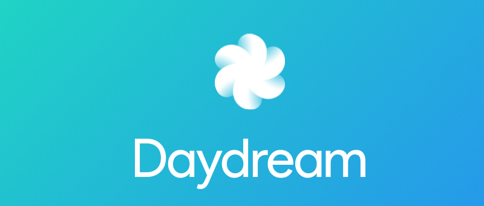
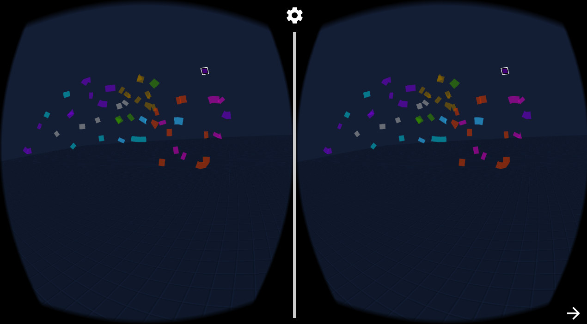
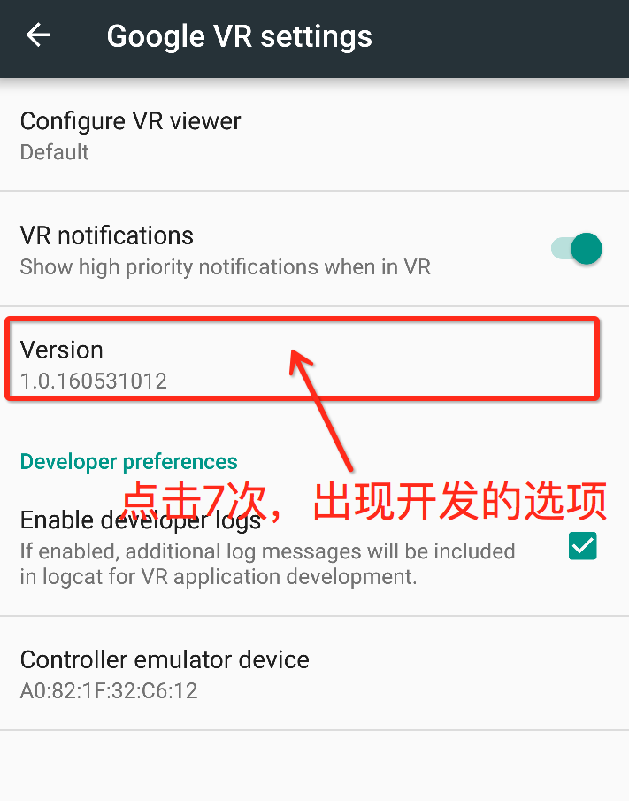
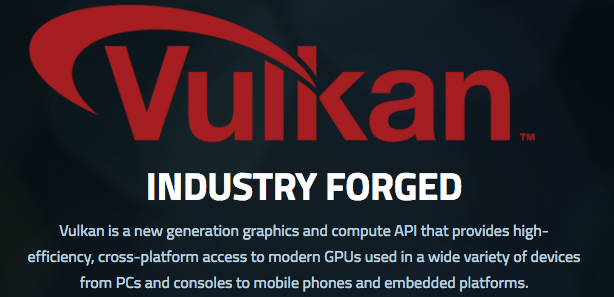

# Android N新特性调研

## DayDream VR

当前Android N VR的开发需要Nexus 6P来支持，目前市面上暂时没有手机能满足`DayDreamVR`的要求。

不过我们可以使用另外一台手机作为DayDreamVR的手柄，在Nexus 6P需要打开DayDreamVR的开发者选项和手柄配对即可使用。

为了提高渲染的性能，Android N为App引入了VR模式，在该模式下，图像渲染变得更加直接，延迟也更低。

1. [Designing & Developing for the Daydream Controller - Google I/O 2016][1]
2. [Set up a Daydream Development Kit][2]

## Vulkan

Android N的另一大特性就是支持新的图形接口`Vulkan`，它也是一种薄驱动设计理念的跨平台（Windows，Android，Linux）图形函数接口。它统一了桌面和移动平台的图形接口，实现了一次编码即可运行在多个目标平台。

[1]:https://www.youtube.com/watch?v=l9OfmWnqR0M
[2]:https://developers.google.com/vr/concepts/dev-kit-setup