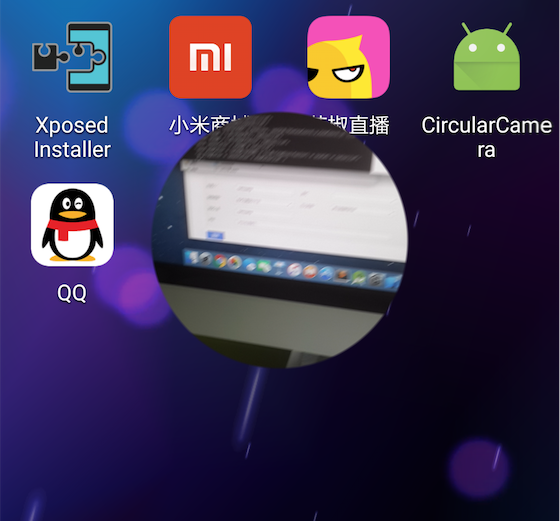

# Android 圆形 Camera 实现

最近遇到这样的功能需求：`在某个界面上唤起一个背景透明的圆形Camera`。




首先的想法是，把相机预览界面绘制到Canvas上，然后用canvas做裁剪，但是会有性能问题，于是就想到
利用GLSurfaceView配合GLSL处理来展示圆形的Camera。

我的方案是：

* 第一步：将Camera预览界面绘制到正方形的网格上面

* 第二步：获取到Camera预览的纹理并将它贴到正方形网格，这时看到的是压扁了的图像

* 第三步：利用OpenGL ES & GLSL处理预览的纹理。

**在第三步，我们要处理几个问题：**

* 图像变形
* 背景透明
* 圆形边缘锯齿

>对于第一个问题，直接想到的办法是对预览的图像做正方形截取，但是效率太低，直接pass，
所以只能从Shader入手了，第一次尝试是将纹理的y放大1.33倍（图像大小是640x480）采样，
得到的图像比例终于正常了，但是会有瑕疵，图像边缘会有横条，
再换个思路，按0.75倍的x轴坐标采样纹理，这次终于没有横条纹了，简直完美！

于是，Shader就写成了这样：

```java
    private final String fragmentShaderCode =
	    "#extension GL_OES_EGL_image_external : require\n"+
	    "precision mediump float;" +
	    "varying vec2 texCoord;\n" +
	    "uniform samplerExternalOES s_texture;\n" +
	    "void main() {\n" +
	    "vec2 coord = texCoord - vec2(0.5, 0.5);\n" +
	    "float radius = length(coord);\n"+
	    "vec4 color = texture2D( s_texture, vec2(0.75*texCoord.x,texCoord.y) );\n"+
	    "float factor = 1.0-step(0.5, radius);\n"+
	    "gl_FragColor = color*factor;\n" +
	    "}";
```

>但是处女座的同学又会发现圆形图像的边缘并不光滑，存在一些锯齿。于是我采取了这样的策略，对于图像边缘的锯齿做Alpha透明的渐变处理，完美地解决掉了这个问题。

这是**最终版Shader：**

```java
    private final String fragmentShaderCode =
	    "#extension GL_OES_EGL_image_external : require\n"+
	    "precision mediump float;" +
	    "varying vec2 texCoord;\n" +
	    "uniform samplerExternalOES s_texture;\n" +
	    "void main() {\n" +
	    "vec2 coord = texCoord - vec2(0.5, 0.5);\n" +
	    "float factor=0.49;\n"+
	    "float scale = 1.0/(0.5-factor);\n"+
	    "float radius = length(coord);\n"+
	    "vec4 color = texture2D( s_texture, vec2(0.75*texCoord.x,texCoord.y) );\n"+
	    "float stepA = 1.0-step(0.5, radius);\n"+
	    "float stepB = 1.0-step(factor, radius);\n"+
	    "vec4 innerColor = stepB * color;\n"+
	    "vec4 midColor = (stepA-stepB) * (1.0-(radius-factor) * scale) * color;\n"+
	    "gl_FragColor = innerColor + midColor;\n" +
	    "}";
```

点击[此处查看Demo源码](https://github.com/TsinStudio/AndroidDevSample/tree/master/CircularCamera)
