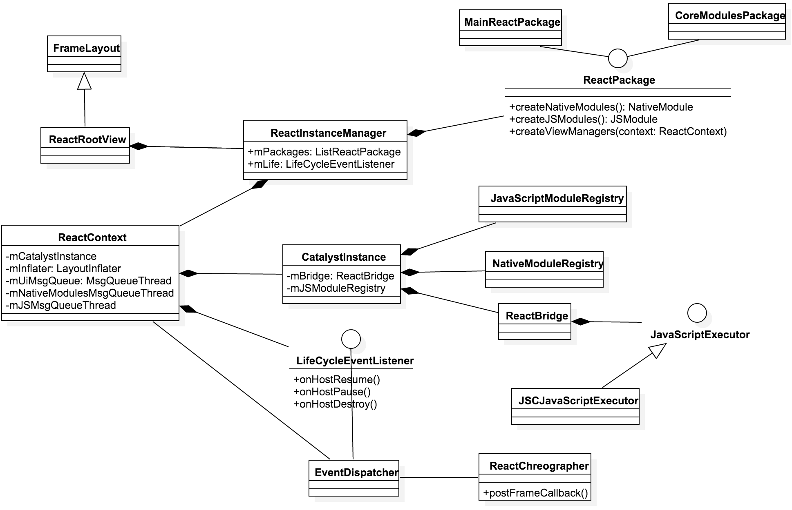
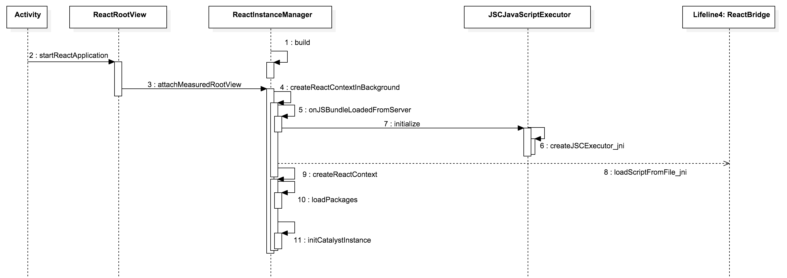

# React Native On Android 介绍

近期，Facebook将**`React Native`**的**Andorid**版本也开源了，React Native是一个用于本地UI开发的javascript框架，目前FB通过JavascriptCore解释器将Andorid的框架层调用和JS绑定实现跨语言的调用。

---

## React Native初体验

> 目前React Native Android的开发只适用于Mac系统，开发前的准备，除了安装完基本的Android SDK／NDK环境后，还需要安装brew（Mac下的软件包管理器，类似apt）、npm（node包管理器）等。详细的安装步骤见**[Getting Started](https://facebook.github.io/react-native/docs/getting-started.html)**，安装过程中遇到的大部分问题在React的**[Github issues](https://github.com/facebook/react-native/issues)**中都有解决。

---

## JSX


``` javascript
var HelloMessage = React.createClass({
  render: function() {
    return <h1>Hello {this.props.name}</h1>;
  }
});

ReactDOM.render(
  <HelloMessage name="John" />,
  document.getElementById('example')
);
```


> JSX是一种类似XML语法的脚本扩展语法，并不能直接被JS引擎直接解释执行，它需要利用其他JS脚本把JSX翻译成JS来完成执行。


---

## React Native(Android)实现原理


---

### Node服务端

### Android客户端



初始化



模块注册

Java－JS通信

 
---

## React Native框架使用指南

### 定制React UI组件

``` java
public class MyCustomViewManager extends SimpleViewManager<MyCustomView> {

  private static final String REACT_CLASS = "MyCustomView";

  @UIProp(UIProp.Type.STRING)
  public static final String PROP_MY_CUSTOM_PROPERTY = "myCustomProperty";

  @Override
  public String getName() {
    return REACT_CLASS;
  }

  @Override
  protected MyCustomView createViewInstance(ThemedReactContext reactContext) {
    return new MyCustomView(reactContext);
  }

  @Override
  public void updateView(MyCustomView view, CatalystStylesDiffMap props) {
    super.updateView(view, props);

    if (props.hasKey(PROP_MY_CUSTOM_PROPERTY)) {
      view.setMyCustomProperty(props.getString(PROP_MY_CUSTOM_PROPERTY));
    }
  }
}
```

``` javascript
var React = require('react-native');
var { requireNativeComponent } = React;

class MyCustomView extends React.Component {
  render() {
    return <NativeMyCustomView {...this.props} />;
  }
}
MyCustomView.propTypes = {
  myCustomProperty: React.PropTypes.oneOf(['a', 'b']),
};

var NativeMyCustomView = requireNativeComponent('MyCustomView', MyCustomView);
module.exports = MyCustomView;
```


---

### 实现Native模块

在Android平台下创建一个简单的Java Native模块，只需要继承**ReactContextBaseJavaModule**该类，并在需要导出至JS的函数加上注解`@ReactMethod`即可。

> 另外你需要将这个模块需要注册到**ReactPackage**。


``` java
public class MyCustomModule extends ReactContextBaseJavaModule {

// Available as NativeModules.MyCustomModule.processString
  @ReactMethod
  public void processString(String input, Callback callback) {
    callback.invoke(input.replace("Goodbye", "Hello"));
  }
}

```

下面是js调用native的代码：

``` javascript
var React = require('react-native');
var { NativeModules, Text } = React;
var Message = React.createClass({
  getInitialState() {
    return { text: 'Goodbye World.' };
  },
  componentDidMount() {
    NativeModules.MyCustomModule.processString(this.state.text, (text) => {
      this.setState({text});
    });
  },
  render: function() {
    return (
      <Text>{this.state.text}</Text>
    );
  }
});

```

---

### 性能跟踪与调试


---

## 扩展


---

## 参考

1. [React: a javascript library for building user interfaces.][1]
2. [React Native: A FRAMEWORK FOR BUILDING NATIVE APPS USING REACT][2]

[1]:https://facebook.github.io/react/
[2]:https://facebook.github.io/react-native/