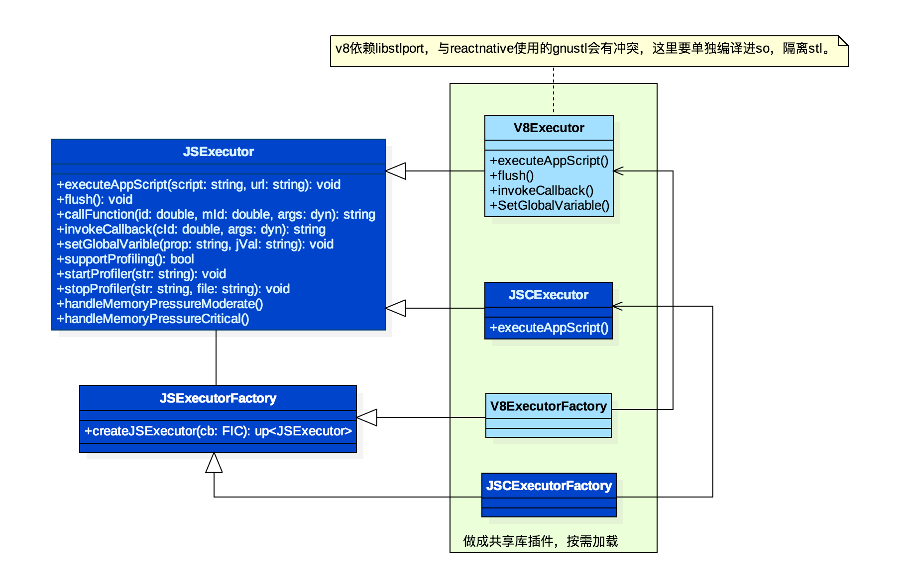

#React Native Android V8接入

## 背景

当前官方提供的RN存在一些难解的底层Crash，部分发生在JavaScriptCore引擎底层，由于官方未提供JSC源码导致问题无法定位，所以我们需要寻求可控的JS引擎，这里我们找到了Google提供的V8引擎。


V8包含了一个高效的JavaScript [JIT][1]，运行效率在众多JS引擎中脱颖而出，这也是我们选择它的原因之一。

## 方案概览

ReactNative JNI层设计之初就考虑了JS后端的扩展性，所以采用了**抽象工厂模式**实现了JSExecutor。



这里我们适配的工作量少了许多，我们只需要提供V8的一个后端实现就可以兼容原有逻辑。而且ReactNative不存在多的
`Native－JS`绑定接口，我们需要实现的接口也就很少了。

> 注意：由于早期的V8使用了stlport提供C++ STL库，它与ReactNative使用的GNUSTL并不兼容，因此我们需要将V8的接口全部编译进单独的共享库（不能是静态库），然后编译reactnativejni时再链接这个动态库，这样就可以完成STL的隔离。


## 实现细节


V8支持多种机器指令的JIT，由于我们适配的是Android ARM平台，这里我们使用支持ARM以及ARM64JIT的V8。

---

### 编译

V8的编译有两套选择GYP和GN。
由于笔者使用的是Mac，所以只能采用GYP来构建V8。
详细的构建方法见[链接][2]。

> 图省事的话，也可以直接使用笔者编译的[libv8rt.so][4]，这个库是基于[v8-5.5.1][5]构建的。

---

### V8 RN适配

1. Native接口绑定

	这里我们适配的是ReactNative0.17-stable和V8-5.5.1。我们先来看JSCExecutor的实现：

	```cpp
	JSCExecutor::JSCExecutor(FlushImmediateCallback cb) :
	    m_flushImmediateCallback(cb) {
	  m_context = JSGlobalContextCreateInGroup(nullptr, nullptr);
	  s_globalContextRefToJSCExecutor[m_context] = this;
	  installGlobalFunction(m_context, "nativeFlushQueueImmediate", nativeFlushQueueImmediate);
	  installGlobalFunction(m_context, "nativeLoggingHook", nativeLoggingHook);
	  ...
	}
	
	static JSValueRef nativeFlushQueueImmediate(
	    JSContextRef ctx,
	    JSObjectRef function,
	    JSObjectRef thisObject,
	    size_t argumentCount,
	    const JSValueRef arguments[],
	    JSValueRef *exception) {
		...
	}
	
	static JSValueRef nativeLoggingHook(
	    JSContextRef ctx,
	    JSObjectRef function,
	    JSObjectRef thisObject,
	    size_t argumentCount,
	    const JSValueRef arguments[], JSValueRef *exception) {
		...
	}
	```
	
	从JSCExecutor的构造函数中看出，native暴露给Javascript的接口只有flush和log的接口，那么在V8Executor里我们同样需要实现相同的绑定。
	
	```cpp
	namespace v8 {
	
	Handle<Context> CreateShellContext(Isolate* isolate) {
	  Handle<ObjectTemplate> global = ObjectTemplate::New(isolate);
	  /**
	  	* ObjectTemplate用于包装C++的对象成v8::Object，
	  	* 它也提供内部存储空间（internal field），相当于C++的成员变量，
	  	* 我们可以通过SetInternalFieldCount设定内部储存多少个变量，
	  	* 这里我们用来绑定RN用到的基本接口。
	  	*/
	  auto functionTemplate = FunctionTemplate::New(isolate, nativeFlushQueueImmediate);
	  /**
	   * FunctionTemplate用来包装C++的方法，这个方法的签名必须符合
	   * function(const FunctionCallbackInfo<Value>& args)->void的形式，
	   * 返回值可以通过args.GetReturnValue().Set(xxx)调用返回给js
	   */
	  functionTemplate->RemovePrototype();
	  global->Set(String::NewFromUtf8(isolate, "nativeFlushQueueImmediate"), functionTemplate); 
	
	  functionTemplate = FunctionTemplate::New(isolate, nativeLoggingHook);
	  functionTemplate->RemovePrototype();
	  global->Set(String::NewFromUtf8(isolate, "nativeLoggingHook"), functionTemplate);  
	
	  return Context::New(isolate, NULL, global);
	}
	
	static void nativeLoggingHook(const FunctionCallbackInfo<Value>& args)
	{
	   ...
	}
	
	static void nativeFlushQueueImmediate(const FunctionCallbackInfo<Value>& args)
	{
	   ...
	}
	
	}
	```
	
	> 上面就用V8的接口实现了JSC相同的Native－JS绑定。


2. 引擎的初始化

	```cpp
	bool initV8 {
	  // 1.初始化国际化字符库
	  V8::InitializeICU(); 
	  // 2.初始化platform库
	  V8::InitializePlatform(g_platform);
	  V8::Initialize();
	  
	  Isolate::CreateParams create_params;
  	  create_params.array_buffer_allocator =
     		v8::ArrayBuffer::Allocator::NewDefaultAllocator();
  	  // 3.创建Isolate 
  	  Isolate* m_isolate = Isolate::New(create_params);
	  s_globalContextRefToV8Executor[m_isolate] = this;
	  // 增加计数，防止数据重新初始化
	  v8::HandleScope handle_scope(m_isolate);
	  /**
	   * 创建JS执行上下文
	   */
	  v8::Handle<v8::Context> context = CreateShellContext(m_isolate);
	  if (context.IsEmpty()) {
		  throwNewJavaException("com/facebook/react/bridge/JSExecutionException", "error init v8 engine!!");
		  return false;
	  }
	  /**
	   * 这里需要将刚创建的Context持久化，否则就会被销毁
	   */
	  m_context.Reset(m_isolate, context); 
	  return true;
	}
	```

3. V8执行Javascript脚本

	```cpp
	bool ExecuteScript(Local<String> script) {
	  HandleScope handle_scope(GetIsolate());
	  TryCatch try_catch(GetIsolate());
	
	  Local<Context> context(GetIsolate()->GetCurrentContext());
	
	  Local<Script> compiled_script;
	  // 编译JS
	  if (!Script::Compile(context, script).ToLocal(&compiled_script)) 
	  	ReportException(GetIsolate(), &try_catch);
	  	return false;
	  }
	
	  Local<Value> result;
	  // 执行
	  if (!compiled_script->Run(context).ToLocal(&result)) {
	    ReportException(GetIsolate(), &try_catch);
	    return false;
	  }
	  return true;
	}
	```

V8引擎的实现大量地利用了C++ RAII的技术，实现过程中应该注意内存问题，
关于JSExecutor其他接口的实现可以参考文末[V8编程指南][3]逐个实现。

---

## 参考

1. [V8 Embedder's Guide][3]
2. [TsinStudio's HelloV8 Sample][6]


[1]:https://github.com/TsinStudio/AndroidDev/blob/master/JIT_Introduction.md
[2]:https://github.com/v8/v8/wiki/D8%20on%20Android
[3]:https://github.com/v8/v8/wiki/Embedder's%20Guide
[4]:https://github.com/TsinStudio/v8-prebuilt/tree/ndk-r10d-armeabi-v7a-release
[5]:https://github.com/TsinStudio/v8-5.5.1
[6]:https://github.com/TsinStudio/AndroidDevSample/tree/master/HelloV8